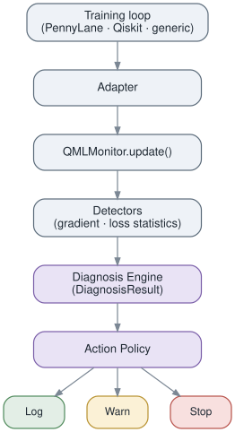

# QML Observer

[](https://github.com/insightlabs38-pixel/QML-Observer/actions/workflows/ci.yml)
[](https://pypi.org/project/qml-observer/)
[](https://pypi.org/project/qml-observer/)
[](./LICENSE)

An open-source observability and diagnostic framework for variational quantum
machine learning (QML) training. QML Observer watches training runs in real
time, detects pathologies such as probable barren plateaus, stagnation, and
noise-dominated optimization, and can log, warn, pause, or stop training
before expensive quantum computation is wasted.

> **Status:** v0.1.0 — public beta. Core schemas, monitoring engine,
> detectors, diagnosis engine, actions, both the PennyLane and Qiskit
> adapters, JSONL logging, run summaries, compute-saved estimation, the
> CLI, and the calibration benchmark suite are all shipped (Milestones
> 0–8). See `CHANGELOG.md` for the full release notes and
> `docs/roadmap.md` for what's next. **The `0.x` API is not yet stable
> and may change without a major-version bump**, per SemVer's `0.x`
> convention.
>
> Note: the `"pause"` action-policy mode currently behaves identically to
> `"warn"` — a distinct pause-and-preserve-state action (`PauseAction`)
> is planned for Milestone 13 and is not yet implemented. See
> `docs/architecture/actions.md`.

## Architecture

<p align="center">
  
</p>

Training events flow one-way through the pipeline above; nothing here ever
owns or drives the quantum computation itself (plan.md §2). See
[`docs/architecture/overview.md`](docs/architecture/overview.md) for the
full, module-by-module breakdown, including the diagnosis engine's
weighted-evidence scoring and the opt-in telemetry layer.

## Scope note

QML Observer targets **simulator-based training only** through the MVP and
all `0.x` releases. Real hardware / cloud QPU integration (IBM Quantum, AWS
Braket, IonQ, etc.) is explicitly out of scope until dedicated funding is
secured. See `docs/roadmap.md` for what hardware support would require.

## Positioning

QML Observer identifies **probable plateau-like failure modes** based on
observed training signals — it does not claim definitive, guaranteed barren
plateau detection in all settings. This distinction is central to the
project's scientific credibility.

## Quickstart

The generic, framework-agnostic path — works with any training loop:

```python
from qml_observer import QMLMonitor
from qml_observer.detectors.barren_plateau import BarrenPlateauDetector
from qml_observer.detectors.convergence import ConvergenceDetector
from qml_observer.detectors.stagnation import StagnationDetector

monitor = QMLMonitor(
    detectors=[
        BarrenPlateauDetector(),
        StagnationDetector(loss_threshold=1e-6, patience=100),
        ConvergenceDetector(loss_threshold=1e-3, gradient_threshold=1e-6, patience=50),
    ],
    policy="warn",
)

for step in range(1000):
    loss, gradients = train_step()  # your own training code
    diagnosis = monitor.update(step=step, loss=loss, gradients=gradients)
    if monitor.should_stop():
        break

print(monitor.finish())
```

Detectors are stateful, so build a fresh list per monitor/run. See the
flagship `examples/pennylane/barren_plateau_demo.py` and
`examples/qiskit/barren_plateau_demo.py` for a complete runnable version
of this pattern with `policy="stop"`.

`monitor.update()` accepts optional `parameters`, `circuit`, `optimizer`,
and `shots` for richer diagnostics. See
[`docs/integrations/generic.md`](./docs/integrations/generic.md) for the
full generic-adapter guide, and the PennyLane/Qiskit examples below for
framework-specific integration.

## Examples

Runnable examples live under `examples/`. PennyLane examples (requires
`pip install -e ".[dev,pennylane]"`):

- `examples/pennylane/basic_monitor.py` — minimal QNode + `QMLMonitor`
  integration, no detectors.
- `examples/pennylane/barren_plateau_demo.py` — the project's flagship
  demo: a healthy run that is never stopped early, contrasted with a
  collapsed-gradient run that is stopped early with an estimated
  compute-saved figure.
- `examples/pennylane/noisy_training.py` — training under a small finite
  shot budget, showing noisier per-step gradient statistics without
  false-positive plateau detection.

Qiskit examples (requires `pip install -e ".[dev,qiskit]"`):

- `examples/qiskit/basic_monitor.py` — minimal `QuantumCircuit` +
  `QMLMonitor` integration via manual parameter-shift gradients, no
  detectors.
- `examples/qiskit/barren_plateau_demo.py` — the Qiskit version of the
  flagship demo: a healthy run that is never stopped early, contrasted
  with a collapsed-gradient run that is stopped early with an estimated
  compute-saved figure.
- `examples/qiskit/vqc_callback_demo.py` — wires `QiskitAdapter.callback`
  directly into a real `qiskit-machine-learning` `VQC` trainer's own
  `callback=` hook, with no manual training loop at all.

## Reporting & CLI

Wire a `RunReporter` into `QMLMonitor` to get a JSONL event/diagnosis log
plus a run summary (including an estimated compute-saved figure) on
`finish()`:

```python
from qml_observer import QMLMonitor
from qml_observer.reporting.reporter import RunReporter

reporter = RunReporter("runs/run.jsonl", framework="pennylane", planned_steps=1000)
monitor = QMLMonitor(reporter=reporter, planned_steps=1000)
```

Then inspect the log from the command line:

```bash
qml-observer report runs/run.jsonl   # human-readable run summary
qml-observer inspect runs/run.jsonl  # every logged record as pretty JSON
```

See [`docs/integrations/qiskit.md`](./docs/integrations/qiskit.md) for the
Qiskit adapter guide.

## Benchmarks & calibration

`benchmarks/run_benchmarks.py` reproduces the false-positive-rate and
detection-latency numbers that chose the detectors' default thresholds;
`benchmarks/qml_observer_benchmark.ipynb` walks through the same results
alongside the live "critical MVP demo". See
[`docs/research/validation.md`](./docs/research/validation.md) for the
full methodology and current results.

## Documentation

Full docs (installation, quickstart, "how to interpret alerts",
architecture, per-detector guides, calibration methodology, and
contributor guides) live under [`docs/`](./docs/index.md).

## Installation

From PyPI:

```bash
pip install qml-observer
```

With an optional framework adapter:

```bash
pip install "qml-observer[pennylane]"
pip install "qml-observer[qiskit]"
```

For local development (editable install with lint/test/type-check tooling):

```bash
pip install -e ".[dev]"
```

**Supported Python versions:** 3.12 and 3.13, on a rolling two-version
window that tracks upstream CPython releases (see `CONTRIBUTING.md`).

**Framework compatibility:**

| Extra        | Tested against        |
|--------------|------------------------|
| `pennylane`  | PennyLane >= 0.35      |
| `qiskit`     | Qiskit >= 1.0, qiskit-machine-learning >= 0.7 |

## Known limitations

- **Diagnoses are probabilistic, not proof.** `POSSIBLE_BARREN_PLATEAU`
  and related issue types describe a pattern consistent with a training
  pathology, observed from loss/gradient statistics — they are not a
  formal, definitive proof of a barren plateau or any other failure mode.
- **`"pause"` currently behaves as `"warn"`.** A distinct pause-and-resume
  action (`PauseAction`) is planned for Milestone 13 and is not yet
  implemented.
- **Simulator-only.** Real hardware/cloud QPU backends (IBM Quantum, AWS
  Braket, IonQ, etc.) are out of scope until Milestone 14+ / dedicated
  funding — see `docs/roadmap.md`.
- **Default detector thresholds are empirically calibrated, not
  universal.** They were tuned against the synthetic benchmark suite in
  `benchmarks/`, not against every possible ansatz/qubit-count/noise
  regime — see `docs/research/validation.md` for methodology and current
  false-positive/detection-latency numbers.
- **Not thread-safe.** One `QMLMonitor` per process/rank is the
  recommended pattern for multi-process training; see the Concurrency
  note in `docs/architecture/overview.md`.
- **No automated recovery yet.** The diagnosis/action layers are
  observational; automatic remediation (re-initialization, ansatz
  switching, etc.) is a post-1.0 feature (Milestone 13).

## Experimental / 0.x API stability

QML Observer is in public beta. The `0.x` API surface may still change
between minor releases as the project incorporates community feedback;
breaking changes will be called out in `CHANGELOG.md` rather than
guaranteed stable per SemVer's `0.x` convention.

## Beta Feedback & Survey

QML Observer is currently in beta, and feedback from real users is one of the most valuable ways to improve it.

If you have tried QML Observer, whether you used it in a real project, tested an example, or simply explored the documentation, I would appreciate your feedback. Your responses will help prioritize bug fixes, improve usability, strengthen detection and diagnosis, and guide future development.

[Take the QML Observer Beta Feedback Survey](https://docs.google.com/forms/d/e/1FAIpQLSfCxgGpVl5sXCX9vw8tSHN6KAjqk5uukw71Kb4lsWQDHQIF1g/viewform?usp=publish-editor)

The survey should take approximately 3–5 minutes to complete.

The survey covers:

- Your quantum ML framework and use case
- Installation and setup experience
- Usability and documentation
- Detection and diagnosis results
- Bugs, unexpected behavior, and edge cases
- Features and improvements you would like to see next
- What would increase your confidence in QML Observer
- Your overall experience with the project

## License

Mozilla Public License 2.0 (MPL-2.0). See [`LICENSE`](./LICENSE) and
[`CONTRIBUTING.md`](./CONTRIBUTING.md#license) for rationale.
