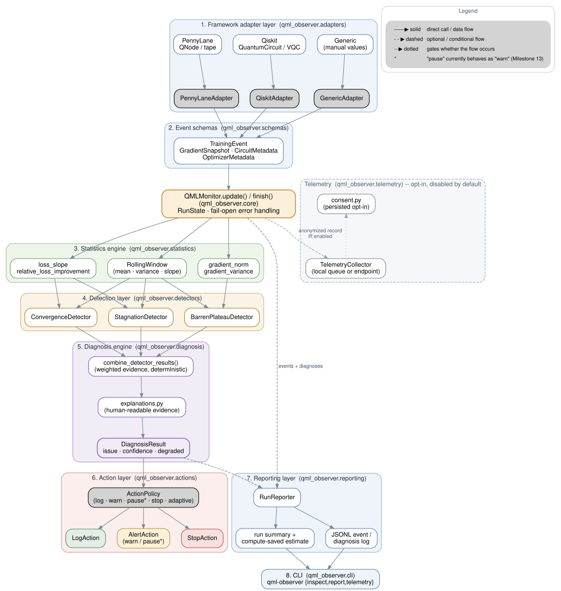

# QML Observer

An open-source observability and diagnostic framework for variational
quantum machine learning (QML). QML Observer watches training telemetry
(loss, gradients, circuit/optimizer metadata) as it happens and flags
training pathologies -- most notably **possible barren plateaus** -- before
expensive quantum computation is wasted.

## What this is (and isn't)

QML Observer is positioned as **QML training observability**, not a barren
plateau oracle. It reports *probable plateau-like failure modes* based on
observed training signals -- gradient collapse, loss stagnation, low
gradient SNR -- and always says "possible", never "confirmed". It also
detects stagnation, distinguishes healthy convergence from bad gradient
collapse, and (from Milestone 9 onward) reasons about shot-noise-dominated
gradients.

It is **not**:

- A barren-plateau *prevention* tool (see the roadmap for ansatz-level
  mitigation strategies).
- Hardware/QPU-aware (see [Scope: simulator-only](#scope-simulator-only)
  below).
- A replacement for understanding *why* your circuit is hard to train --
  the diagnosis engine explains *what* it observed, not the underlying
  quantum-geometric cause (that's the Milestone 12 QFIM/Hessian roadmap).

## Core architecture

  

Frameworks (PennyLane, Qiskit, or a fully generic training loop) flow
through an adapter into the shared `TrainingEvent` schema, then through
`QMLMonitor` into the statistics engine, the detection layer
(`BarrenPlateauDetector`, `StagnationDetector`, `ConvergenceDetector`),
the diagnosis engine (weighted evidence -> one explainable
`DiagnosisResult`), and finally the action layer (log / warn / pause* /
stop / adaptive). An optional, disabled-by-default telemetry layer sits
alongside this path -- see the diagram's dashed/dotted edges.

See [`architecture/overview.md`](architecture/overview.md) for the full
layer-by-layer breakdown.

## Scope: simulator-only

Through the entire `0.x` release series, QML Observer targets **simulators
only**. Real hardware/cloud QPU integration (IBM Quantum, AWS Braket, IonQ)
is explicitly out of scope until funding is secured -- see
[`roadmap.md`](roadmap.md) for what that would need. The `shots` parameter
already flows through the event schema so no breaking change is required
later; there is simply no backend-specific queue/cost logic yet.

## Where to go next

- New to the project? Start with
  [`getting_started/installation.md`](getting_started/installation.md) and
  [`getting_started/quickstart.md`](getting_started/quickstart.md).
- Integrating a real training loop? See
  [`integrations/pennylane.md`](integrations/pennylane.md),
  [`integrations/qiskit.md`](integrations/qiskit.md), or
  [`integrations/generic.md`](integrations/generic.md).
- Want alerts delivered somewhere other than the terminal (Slack, a
  custom backend)? See [`integrations/webhook.md`](integrations/webhook.md).
- Wondering what a diagnosis means? See
  [`detectors/barren_plateau.md`](detectors/barren_plateau.md),
  [`detectors/stagnation.md`](detectors/stagnation.md), and
  [`detectors/convergence.md`](detectors/convergence.md), plus the
  dedicated ["How to interpret alerts"](getting_started/concepts.md#how-to-interpret-alerts)
  section.
- Curious how confident you should be in a diagnosis? See
  [`research/methodology.md`](research/methodology.md),
  [`research/benchmarks.md`](research/benchmarks.md), and
  [`research/validation.md`](research/validation.md).
- Want to contribute? See
  [`development/contributing.md`](development/contributing.md),
  [`development/development_setup.md`](development/development_setup.md),
  and [`development/adding_detectors.md`](development/adding_detectors.md).
- Curious what data ever leaves your machine? See
  [`development/data_handling.md`](development/data_handling.md) and the
  opt-in telemetry schema in
  [`development/telemetry.md`](development/telemetry.md).
